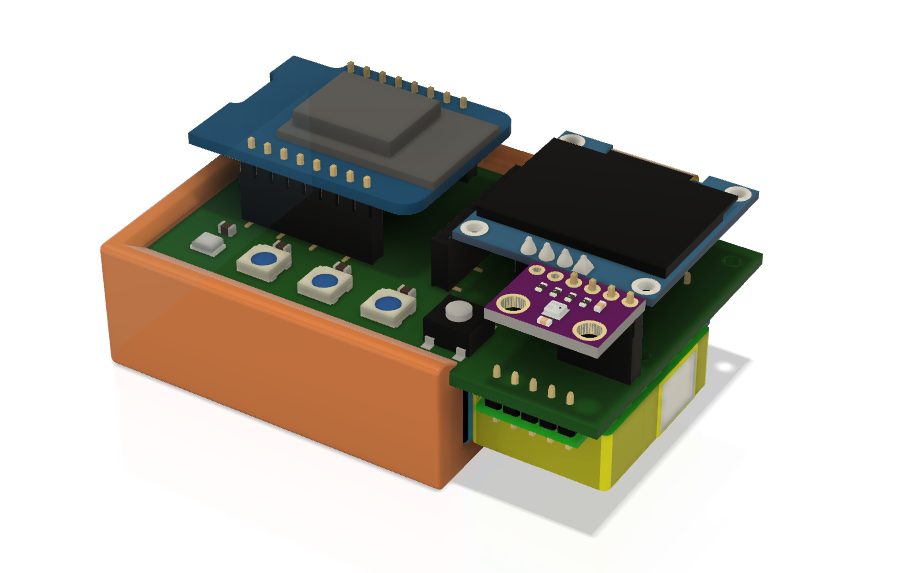

# IAQ (Indoor Air Quality) Board 
IAQ Board is a DIY (Do-It-Yourself) device for measuring internal air quality. I needed a device for measuring some air quality parameters which is **compact, cheap, simple and capable**. After I prototyped it, decided instead of mounting into some odd box with cables hanging inside between the sensors, why not just solder everything on a printed circuit board. I had some experience with this from the time when I was a student years ago and luckily now it's much easier to crate PCB and very cheap to get it printed. 

**And here is my device. I am publishing all the details and documentation under '[open source hardware](https://en.wikipedia.org/wiki/Open-source_hardware)' CC-BY-CA license, so everyone can build, adapt and sell it, as long as share under the same license**

**Table of Contents**
   * [IAQ (Indoor Air Quality) Board](#iaq-indoor-air-quality-board)
      * [What exactly is this thing?](#what-exactly-is-this-thing)
      * [Who can build it?](#who-can-build-it)
      * [What about ordering a device?](#what-about-ordering-a-device)
   * [Components Details](#components-details)
      * [1. PCB](#1-pcb)
      * [2. Holder case](#2-holder-case)
      * [3. Microcontroller Board](#3-microcontroller-board)
      * [4. Dust Sensor](#4-dust-sensor)
      * [5. CO2 sensor](#5-co2-sensor)
      * [6. Temperature/Humidity/Pressure sensor](#6-temperaturehumiditypressure-sensor)
      * [7. Ambient Light Sensor](#7-ambient-light-sensor)
      * [8. LEDs](#8-leds)
      * [9. Displays](#9-displays)
      * [10. Volatile Organic Compound sensor](#10-volatile-organic-compound-sensor)
      * [11. Other electrical components](#11-other-electrical-components)
      * [Can you skip components?](#can-you-skip-components)
   * [Bill of Materials (BOM)](#bill-of-materials-bom)
   * [Firmware](#firmware)
   * [Schematic](#schematic)
   * [Soldering tips](#soldering-tips)
   * [User manual](#user-manual)
         * [Multi function button](#multi-function-button)
         * [LED Brightness control and correction](#led-brightness-control-and-correction)
   * [FAQ](#faq)
            * [<em>Can I power it from a battery?</em>](#can-i-power-it-from-a-battery)
            * [<em>Can it be installed outdoors?</em>](#can-it-be-installed-outdoors)
            * [<em>How to calibrate MH-Z19B CO2 sensor?</em>](#how-to-calibrate-mh-z19b-co2-sensor)
            * [<em>How to calibrate SGP30 VOC sensor?</em>](#how-to-calibrate-sgp30-voc-sensor)
            * [<em>How to connect to WiFi?</em>](#how-to-connect-to-wifi)
            * [<em>How to add it in Home Assistant?</em>](#how-to-add-it-in-home-assistant)
            * [<em>What if some of the sensors/displays is disconnected while the device works?</em>](#what-if-some-of-the-sensorsdisplays-is-disconnected-while-the-device-works)
         * [<em>What about short circuits of the exposed electronics?</em>](#what-about-short-circuits-of-the-exposed-electronics)
   * [More Tech Details](#more-tech-details)
   * [Known issues](#known-issues)
   * [License](#license)

## What exactly is this thing?
The device is based on widely available and cheap essential components ([MCU](https://en.wikipedia.org/wiki/Microcontroller) and sensors). The core component is a simple [PCB](https://en.wikipedia.org/wiki/Printed_circuit_board) (printed circuit board) that's why I called it **IAQ Board**. The board integrates all the components in a very small footprint (size of a cigarette box). All parts are soldered on it and everyone can assemble it with basic soldering skills. The total price if you build it yourself is about 50-60 EUR. I also made simplistic holder for 3D print (6-7 EUR is you don't have a 3D printer). For these amount of money you get the following air parameters measured adequately (you might not install all sensors if you want to save money): 
- [X] ***Temperature / Humidity / Pressure***
- [X] [***Air particles PM1, PM2.5, PM10***](https://en.wikipedia.org/wiki/Particulates)
- [X] [***Carbon Dioxide with NDIR sensor***](https://en.wikipedia.org/wiki/Indoor_air_quality#Carbon_dioxide)
- [X] [***Air Quality Index by EPA, based on 24h average PM2.5 particles***](https://airindex.eea.europa.eu/Map/AQI/Viewer/)
- [X] [***Ambient light***](https://en.wikipedia.org/wiki/Illuminance)
- [X] [***Total VOC (volatile organic compound)***](https://en.wikipedia.org/wiki/Volatile_organic_compound)
- [X] ***equivalent CO2 (not very correct compared with the NDIR sensor, but it's provided by the VOC sensor)***

**On top of that:**
- [X] ***At least one OLED display to show the data (can have one more on the top of the MCU board)***
- [X] ***three RGB wide angle LEDs with auto brightness. LED1 indicates PM2.5, LED2 - Air quality index, LED3 - CO2.*** 
- [X] ***auto night dimming of the displays and LEDs (can be disabled)***
- [X] ***MIN/MAX values of Temperature, PM2.5 and CO2, and 24h average PM2.5 value.***
- [X] ***multi function button for selection of the data to show on the display***
- [X] ***[firmware](https://en.wikipedia.org/wiki/Firmware) based on [ESPhome](https://esphome.io/), the device can be [directly added](https://esphome.io/components/api.html) in [Home Assistant](https://www.home-assistant.io/)***
- [X] ***WiFi access to the device with http server and [REST API](https://esphome.io/web-api/index.html) and [esphome native API](https://esphome.io/components/api.html)  to read the sensor data***

Here is a video with all you need to know:

[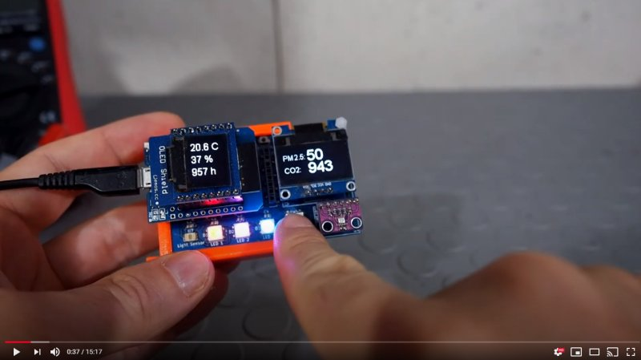](https://www.youtube.com/watch?v=X75OGs2TTT8)

## Who can build it?
The device is just a simple PCB board and almost everyone with some soldering skills can assemble it in a few steps:
1. [Download the PCB files](kicad/) and print the PCB somewhere like https://jlcpcb.com/
2. Buy some components (listed in the bill of materials section) from Aliexpress or any other source.
3. Solder everything on the board. With the exception of the ambient light sensor, all the rest is pretty easy with general soldering skills. Soldering light sensor can be done with regular soldering iron, but because of the small size of the IC, it's easier if you have heat gun or SMD reflow oven/plate. [Here is video how to complete device from assembled PCB.](https://www.youtube.com/watch?v=b2oDBgN3h1w)
4. Flash the microcontroller with the esphome firmware [following the manual](firmware/). You can write your own firmware if you have the skills. :smile: 
5. Print the holder case on 3D printer if you wish. I have some sensors without it and they are perfectly fine, so it's up to you.

If you have experience with electronics and microcontrollers just check the [schematics](kicad/) and make whatever you wish - build your own firmware, do another PCB, connect external sensors, don't use it at all because you can make it better :smile:. The device is quite simple for embedded electronics enthusiasts anyway...

## What about ordering a device?
I made this device for me and then decided to share it. I think a lot of people might be interested to have such air quality sensor. I did not have intension to make money from it, that's why it's "open hardware" and I publish all of the information, so everyone can build it. 

However I know that someone might be interested in the device, but lack the skills to build it. [Please follow this link for more details.](ordering.md)

# Components Details
The device with AAA battery size comparison:

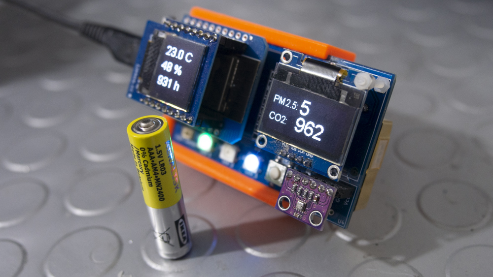
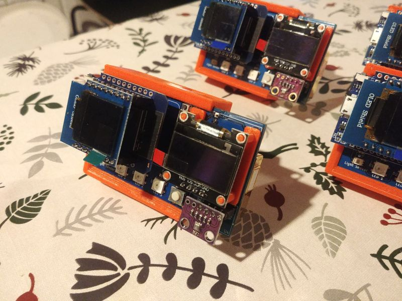
## 1. PCB
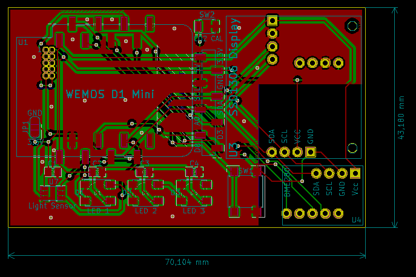
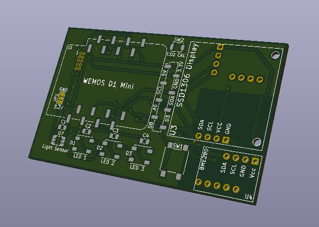

The PCB (printed circuit board) is very simple and compact. It's 70x43mm (photos above are showing it larger than the actual size). It just connects a few sensors, microcontroller and displays. I wanted to integrate it in as much smaller footprint as possible, so the whole device is like a cigarette box. Most of the parts are surface mounted which makes the soldering just a bit more complicated, but still not a big deal. And of course it could be integrated even more by soldering all individual components on the PCB but then it's not really a hobby project anymore and much more difficult to build it.
It's designed on [KiCad](https://kicad.org/) and in the [kicad folder](kicad/) you can find full KiCad project, PCB gerber files, etc.
## 2. Holder case
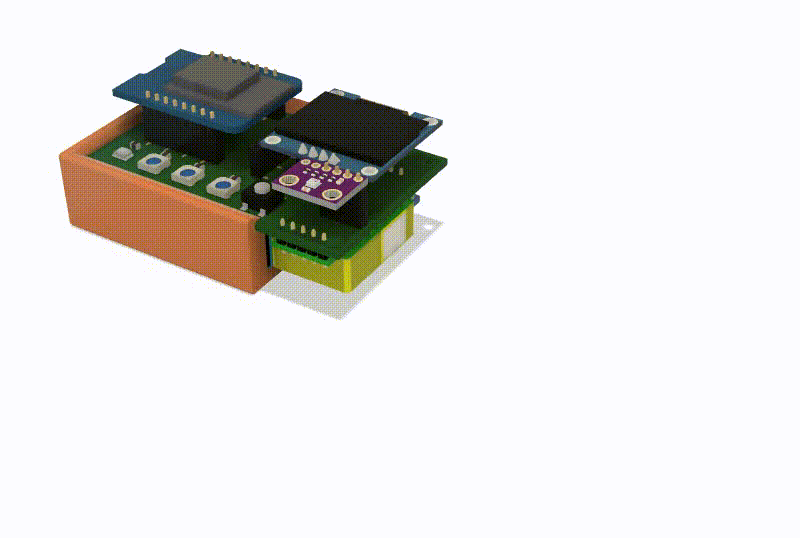

For any device the box is important. However my idea was to expose the PCB and electronics as much as possible in order to simplify it. I like the "raw" view of electronics and in this form I find it beautiful. 

Taking into account this, I designed a simple holder case for "sliding" the PCB in it and holding the particle sensor. The case can stay at about 45 degrees angle. It is designed on Fusion 360 and the [details are here](case_model). The holder case is not perfect, I was thinking to redesign it but no time for this. I am sure someone can do it better. :smile: Or design a complete box to cover the electronics fully, for me it is better in this minimalistic style. 
## 3. Microcontroller Board
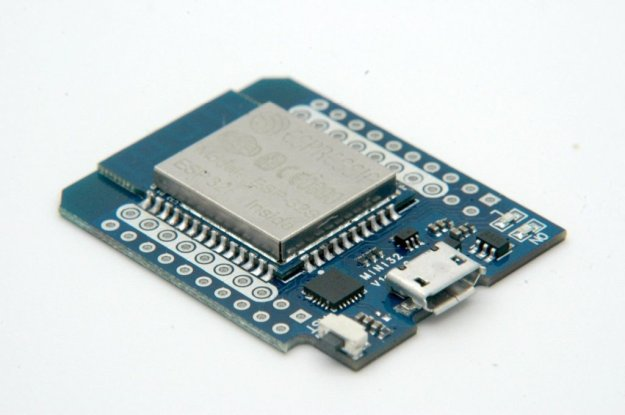

Initially I developed the board with using the most popular WiFi enabled MCU [ESP8266](https://en.wikipedia.org/wiki/ESP8266) mounted on the cheap and small [Wemos D1 Mini board](https://docs.wemos.cc/en/latest/d1/d1_mini.html). However this MCU have some limitations described in the [tech details](#more-tech-details), so I changed it with the same size board compatible with Wemos D1 Mini, but running the newer much more powerful MCU of the same company - [ESP32](https://en.wikipedia.org/wiki/ESP32). In that way the device is quite stable, can run web server and since the board is having the same layout, on top of the D1 Mini ESP32 board you can connect extra display designed for d1 mini very easy. PCB is compatible with both D1 Mini ESP8266 or ESP32, even the labels are the same like on the older D1 board. However **I do not recommend to use D1 mini with ESP8266!** Also if I have to build next version of the PCB (I still have some 25 pcs), I will change the pins of one of the dust sensors.

These small size MCU board are pretty nice, they are tiny, have USB connector, onboard power supply and USB converter for programming or serial output. And you are powering the whole device just with a mini USB cable.
## 4. Dust Sensor
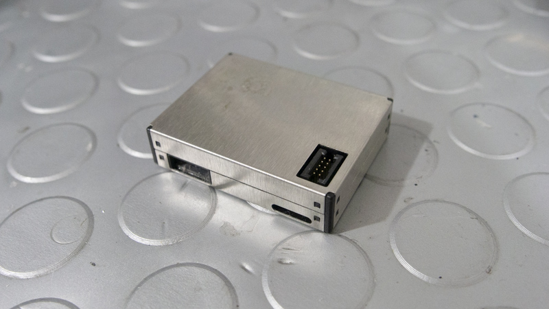

Dust sensor is the Chinese [Plantower PMS7003](http://www.plantower.com/en/content/?110.html) - 1, 2.5 and 10 micron particle laser sensor. It's very small and is perfect for indoor environment. 
## 5. CO2 sensor
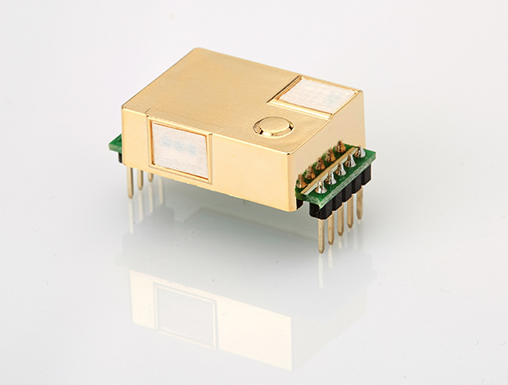

Carbon dioxide sensor is the Chinese [Winsen MH-Z19B](https://www.winsen-sensor.com/sensors/co2-sensor/mh-z19b.html) - the most expensive part of the device. It's quite popular for hobby air quality meters and can [adequatly measure](https://www.circuits.dk/testing-mh-z19-ndir-co2-sensor-module/) up to 5000 ppm CO2 concentration.

**Keep in mind that there are some fake MH-Z19B sensors, [explained here](https://revspace.nl/MH-Z19B#Fake_MH-Z19B_.28black_PCB.29).**
## 6. Temperature/Humidity/Pressure sensor
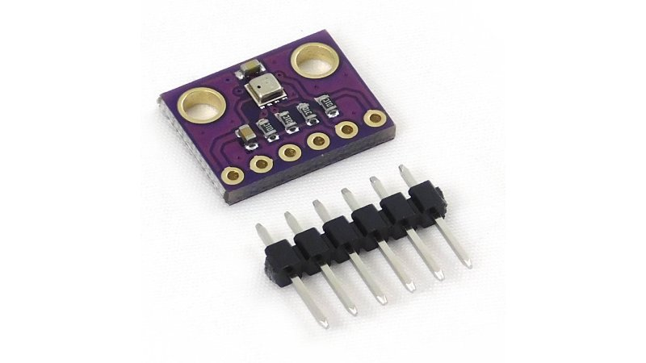

This sensor is the popular [Bosch BME280](https://www.bosch-sensortec.com/products/environmental-sensors/humidity-sensors-bme280/), mounted on 3.3V only breakout board from China. There are also smaller [breakout boards](http://www.cncroutersource.com/breakout-boards.html) from China working both on 5V and 3.3V, but these have voltage regulator which can theoretically warm the board and change the temperature reading. That's why I use the boards with 3.3V only.

**Please note that due to semiconductor shortage these are difficult to find now (June 2021). I am currently using my own breakout where I solder the BME directly. BME280 as IC can be found occasionally in stock from DigiKey**
## 7. Ambient Light Sensor
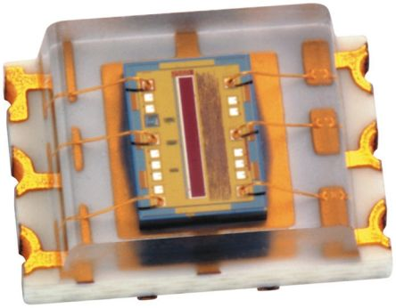

The light sensor is [TSL 2561](https://ams.com/tsl2561) and it's the only sensor you need to solder directly on the board without a breakout board. I added this sensor not because I need to measure the ambient light but because I am a brightness freak, and I need the LEDs brightness to depend on the ambient light. Also wanted during the night when the lights are off the device to turn off the LEDs and displays automatically. You can also change the behavior of this brightness control and I spend some extra time developing the config only for the brightness features. :smile:
## 8. LEDs

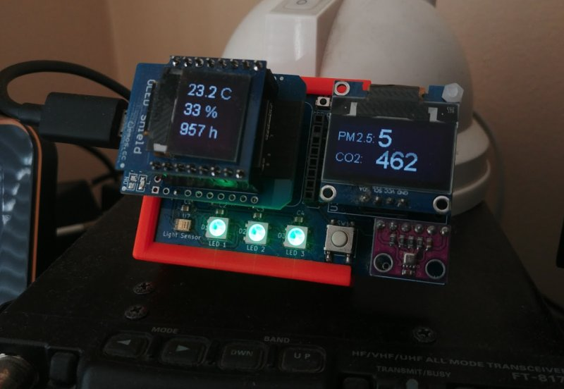

The device have three [Neopixel 5050](https://www.digikey.com/catalog/en/partgroup/neopixel-rgb-5050-led-with-integrated-driver-chip-100-pack/70939) RGB multicolor LEDs. These LEDs are mostly found in the colorful LED strips and are controlled over a single wire. In my esphome based firmware left LED color is indicating the level of PM2.5 and change the colors depending on the value. Middle (LED2) indicates Air Quality Index based on PM2.5 only and the right one (LED3) indicates CO2 value. Keep in mind PM2.5 values are close to [EEA](https://www.eea.europa.eu/) levels (especially AQI). Some other devices like Xiaomi Air Purifiers have some very high levels on their displays and logic - it's green up to 70 microns which is already considered unhealthy both by EEA and EPA. In China "healthy" is considered bellow 50 microns. That's why AUTO mode of these Chinese devices [works so bad](https://smartairfilters.com/en/blog/xiaomi-auto-mode-leaves-air-unsafe-86-hours/). I try to keep indoor PM2.5 around 5-10 microns. I normally control my purifiers by Home Assistant and do not rely on their auto logic. If you have Xiaomi Purifier it can still show green, and the iaq device shows stable red, but it is correct according to the EU regulations.

**Colors of the LEDs depends on this table:**
PM2.5 value (um/m3)<br>LED 1 | [AQI by EEA (Air Quality Index for PM2.5 24h average)](https://airindex.eea.europa.eu/Map/AQI/Viewer/)<br>LED 2 | CO2 value (ppm)<br>LED 3 | Color |  R  |  G  |  B
:-----------------: | :-------------: | :-------------: | :---: | :-: | :-: | :-: 
< 10 | < 10 (Good) | < 700 |  | off | on | off 
11 - 20 | 10 - 20 (Fair) | 700 - 1000 |  | off | on | on 
20 - 30 | 20 - 25 (Moderate) | 1000 - 1500 |  | on | on | off 
30 - 40 | 25 - 50 (Poor) | 1500 - 2100 |  | on | off | on 
\> 50 | > 50 (Very Poor) | > 2100 |  | on | off | off 

## 9. Displays
The main display is the popular SSD1306 128x64 OLED display. On the top of the MCU board you can install extra [OLED 63x48](https://docs.wemos.cc/en/latest/d1_mini_shiled/oled_0_66.html) shield from Lolin which shows temperature, humidity and air pressure only.
## 10. Volatile Organic Compound sensor
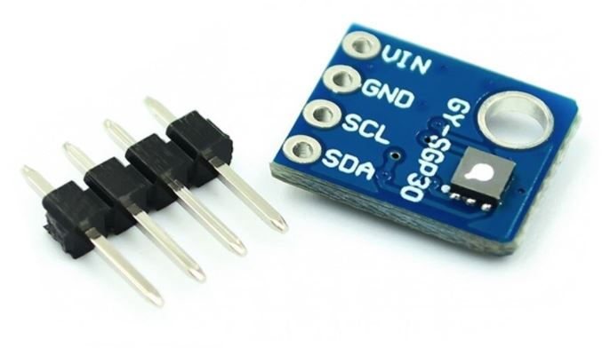

This is the [Sensirion SGP30](https://www.sensirion.com/en/environmental-sensors/gas-sensors/sgp30/) senor mounted on a breakout board from China. I do not use it on all my devices, but I added it because I can. :smile: Also with it the device measures almost completely the internal air quality. SGP30 is also showing equivalent CO2 based on VOC but it's not precise compared with MH-Z19B NDIR sensor. Also it needs periodic calibration hardcoded in the firmware which makes it more tricky to use.

Please [check here](https://github.com/nkitanov/iaq_board/issues/10#issuecomment-798994427) for the known issues with these boards.
## 11. Other electrical components
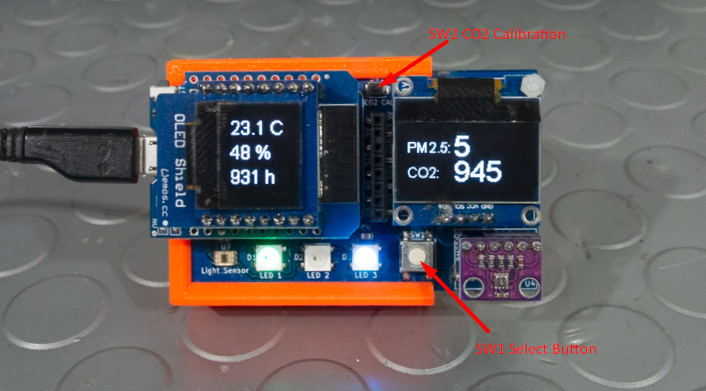

The device have 2 buttons - one for selection screens and settings, and another micro button for calibration of the CO2 sensor to 400ppm if you keep it pressed for more than 7 sec. 

There are also four [surface mounted](https://en.wikipedia.org/wiki/Surface-mount_technology) [bypass capacitors](https://en.wikipedia.org/wiki/Decoupling_capacitor) for the ambient light sensor and the LEDs.


## Can you skip components?
Yes. The minimum you need is the [microcontroller board](#3.-microcontroller-board). However since you don't have any sensors, you won't get any data. :smile: You can add only the sensors needed. Also if you skip ambient light sensor there will be no auto brightness control and the LEDs will operate always at 25% intensity. Installing only the ambient light sensor without any of the displays or any of the other [I2C](https://en.wikipedia.org/wiki/I%C2%B2C) sensors (BME280, SGP30) will not work as there are no [pullup resistors](https://en.wikipedia.org/wiki/Pull-up_resistor) on the PCB for the I2C bus since it uses the resistors of the external breakout boards.


# Bill of Materials (BOM)
Bellow is the list of all parts needed to assemble the device with links to sources where you can get them. Of course other sources can be used, just pay attention that the items are identical with the listed bellow. For example the SSD1306 display can be found with similar physical look and dimensions, but pins are not the same.

Schematic Ref | ITEM | pcs | Comment
--------------| ---- | :-: | -------
| | PCB Board | 1 | in [kicad folder](kicad) you can find all the data and GERBER PCB design files
U1 | [WeMos_D1_mini_ESP32](https://www.aliexpress.com/item/4000880936043.html?spm=a2g0o.productlist.0.0.f387754egZVnTc&algo_pvid=b105e43b-6669-40bc-99c4-cf22d026995d&algo_expid=b105e43b-6669-40bc-99c4-cf22d026995d-6&btsid=0bb0623616009843570355505e4ca0&ws_ab_test=searchweb0_0,searchweb201602_,searchweb201603_) | 1 | [ESP8266 version](https://www.wemos.cc/en/latest/d1/d1_mini.html) also can work but not recommended 
U2 | [PMS7003 Sensor](https://www.aliexpress.com/item/32832444694.html?spm=a2g0s.9042311.0.0.27424c4dKxsO6Z) | 1 | don't use the 2x5pin 1.27mm receptacle which comes normally wit these sensors, explanation is bellow
U3 | [SSD1306 Display](https://www.aliexpress.com/item/32956051129.html?spm=a2g0o.productlist.0.0.523365fcQkP3XC&algo_pvid=b62bd3ab-fe19-479e-bc50-b2c68dd35525&algo_expid=b62bd3ab-fe19-479e-bc50-b2c68dd35525-25&btsid=67d67e08-4ad1-4c08-8cec-e378bae47fc6&ws_ab_test=searchweb0_0,searchweb201602_9,searchweb201603_55) | 1 | pay attention to correct pin order if you are buying from another source, as there are similar 4pin boards with different pinout
U4 | [BME280 breakout board](https://www.aliexpress.com/item/4000166540445.html?spm=a2g0o.productlist.0.0.363a562ely2LZq&algo_pvid=b0bd6068-edbb-4f9c-aa24-92324f726eda&algo_expid=b0bd6068-edbb-4f9c-aa24-92324f726eda-8&btsid=3927b67d-2f89-4594-9f47-b017e00ef8a0&ws_ab_test=searchweb0_0,searchweb201602_9,searchweb201603_55) | 1 | only 3.3V version with 6 pins which have both I2C and SPI. **Please note that due to semiconductor shortage these are difficult to find now (June 2021). I am currently using my own breakout where I solder the BME directly. BME280 as IC can be found occasionally in stock from DigiKey**
U5 | [MH-Z19B Sensor](https://www.aliexpress.com/item/1005001865093513.html?spm=2114.12010610.8148356.5.5b7387a5ZmuUlX) | 1 | **Beware for fake sensors, as [explained here](https://revspace.nl/MH-Z19B#Fake_MH-Z19B_.28black_PCB.29). Buy from Winsen official store in Aliexpress.**  
U6 | [SGP30 breakout board](https://www.aliexpress.com/item/4000004614708.html?spm=a2g0o.productlist.0.0.688164abtt6ZRA&algo_pvid=7f813f70-3c1d-42ee-b6cf-9bf501c47314&algo_expid=7f813f70-3c1d-42ee-b6cf-9bf501c47314-1&btsid=3f683b7d-631a-4373-b0a1-f574cd317549&ws_ab_test=searchweb0_0,searchweb201602_9,searchweb201603_55) | 1
U7 | [TLS2561 light sensor](https://www.aliexpress.com/item/33056165996.html?spm=a2g0s.9042311.0.0.15314c4draqb6x) | 1
C1-C4 | [0.1 uF SMD Capacitor](https://bg.farnell.com/wurth-elektronik/885012207016/cap-0-1-f-10v-10-x7r-0805/dp/2534051?st=smd%20capacitors) | 4
D1-D3 | [Neopixel 5050 LED](https://www.aliexpress.com/item/4000750610574.html?spm=a2g0o.productlist.0.0.55a96722mpqDCp&algo_pvid=4be2d94a-875a-4e56-af12-1f6a3dcdf49f&algo_expid=4be2d94a-875a-4e56-af12-1f6a3dcdf49f-5&btsid=0bb0623416009856118282154ebe61&ws_ab_test=searchweb0_0,searchweb201602_,searchweb201603_) | 3
| SW1 | [Tactile Switch B3S-1000](https://uk.farnell.com/omron/b3s-1000/switch-spno-0-05a-24v-smd/dp/177807) | 1 |
| SW2 | [Tactile Switch B3U-1000P](https://bg.farnell.com/omron/b3u-1000p/switch-spst-no-0-05a-12v-smd/dp/1333652?st=B3U-1000P) | 1
| | [PCB Receptacle, 1.27 mm, 10 Contacts](https://bg.farnell.com/amphenol-icc-fci/20021311-00010t4lf/receptacle-vert-1-27mm-tht-10way/dp/1865313) | 1 | This PCB Receptacle is for connecting PMS7003 dust sensor. Keep in mind these sensors come with such connector included but it's slightly taller and makes a gap of about half mm between sensor and PCB which is not ok.
| | [SMD PCB Receptacle 8 pins](https://uk.farnell.com/samtec/ssm-108-l-sv/receptacle-2-54mm-vert-8way/dp/1668259?st=ssm-108-l-sv%20pcb%20receptacle) | 3 | two are needed for the MCU board, 3rd you can skip. It's for extra pins on the PCB but with ESP32 MCU not needed so much as extra headers can be soldered directly on it's board
| | [PCB Receptacle 4 pin](https://uk.farnell.com/samtec/bcs-104-l-s-te/receptacle-2-54mm-vert-4way/dp/1667470?ost=bcs-104-l-s-te) | 4 | four is needed if all sensors are installed
| | [OLED 63x48 shield](https://www.aliexpress.com/item/32981156326.html?spm=a2g0s.9042311.0.0.27424c4dO21RuC) | 1 | not required, only if you want an extra display on top of the MCU board
| | [Holder case](case_model) | 1 | it's not required to have it but it makes the device completed
| | [Display holder](case_model) | 1 | This small 3D printed part is holding tight the display from flapping 
| | [Various 2.54 headers](https://www.ebay.co.uk/itm/10pcs-40-pin-2-54mm-Breakaway-Male-Header-for-PCB-Breadboard-1x40-Single-Row-UK/262755464818?epid=20008873513&hash=item3d2d723672:g:st8AAOSwMsZdNw5x) | | You will need these for the CO2 sensor if you don't have available. Normally they come together with the breakout boards.
| | [2mm nylon bolts/nuts](https://www.ebay.co.uk/sch/i.html?_from=R40&_trksid=p2047675.m570.l1313&_nkw=2mm+nylon+bolts&_sacat=0) | | If you want to make the display more stable you can install nylon bolts like explained [in the video](https://youtu.be/b2oDBgN3h1w?t=758). Better use [display holder](case_model).

# Firmware
Firmware is created with [ESPHome](https://esphome.io/index.html). The binary file, configuration and instructions are located in [firmware folder](firmware/).

# Schematic
Find all KiCad project in [kicad folder](kicad/) with schematic, PCB design file, 3D models, etc. In schematic U1 (microcontroller board) is based on ESP8266 version (original Wemos D1 mini).
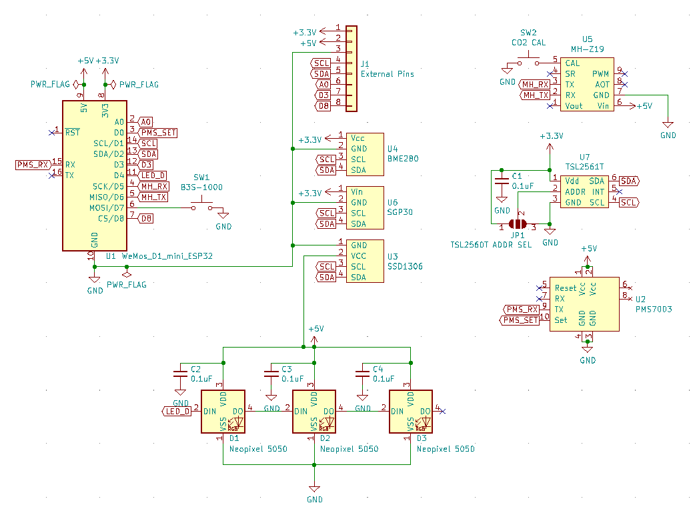

# Soldering tips
You need basic soldering skills and a soldering iron with thin tip. Because most of the components are SMD, it's much easier to buy some [solder paste](https://en.wikipedia.org/wiki/Solder_paste) if you don't have. Most of the SMD components are quite large to solder easily with the iron, you [can look in youtube](https://www.google.com/search?q=solder+smd+components&source=lnms&tbm=vid&sa=X&ved=2ahUKEwien7K4zfbsAhX6BWMBHQMtDZAQ_AUoAnoECBMQBA&cshid=1604964375672299&biw=1600&bih=1097), there are thousand of videos how to solder SMD components. Of course for some parts it's easier to use hotair rework station but not a requirement.

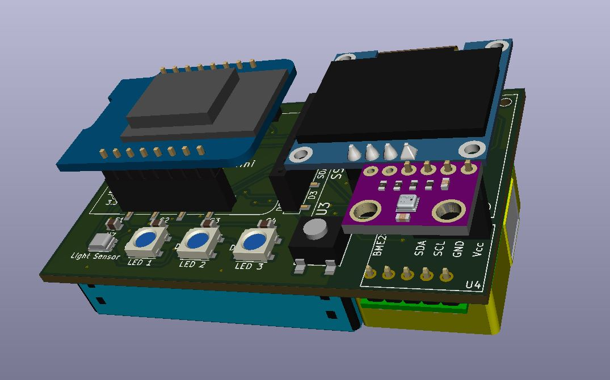

The only more difficult component to solder is the ambient light sensor which is quite small. I normally do these with a thin layer of solder paste and heatgun from bellow. However because of the footpint on the PCB is purposely made a bit bigger, I managed to solder it as well with a regular iron with a thin tip and solder paste. Also magnifying glasses will help.

If you use the small display over the MCU board, make sure i2c address is configured as 0x3D, which means to solder bottom two pads of the solder jumper like here:

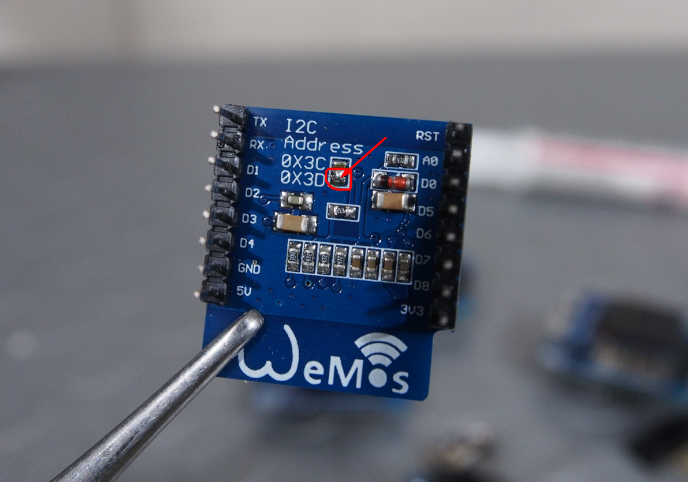

# User manual
It's quite simple, the device have only one "multi functional" button SW1, and one micro button SW2 for calibration of the CO2 sensor.

### Multi function button
- Short press "rotates" the data displayed on the right bigger display. By default it starts showing only PM2.5 and CO2 with larger fonts as these are the most important air quality parameters. This is also the default "screen" and every time the device is restarted it will show that screen. The display is quite small (128x64 pixels) so some of the text is shortened like P1 (for PM1), C (for CO2), etc. Each short press of the button rotates this sequence:
```
DEFAULT==================================================================MIN/MAX===============
PM2.5      AQI        Temperature    PM1         Amb.Light  PM1         Temp. MIN        Displays OFF
CO2 ----> Index ----> Humidity ----> PM2.5 ----> TVOC ----> PM2.5 ----> PM2.5 MIN ----> (both displays  
 ^      PM2.5 24h     Pressure       PM10        eCO2       PM10        CO2 MIN          turned off)
 |                                                          Temperature Temp. MAX             |
 |                                                          Humidity    PM2.5 MAX             |
 |                                                          Pressure    CO2 MAX               |
 | _ _ _ _ _ _ _ _ _ _ _ _ _ _ _ _ _ _ _ _ short click_  _ _ _ _ _ _ _ _ _ _ _ _ _ _ _ _ _ _ _|
```
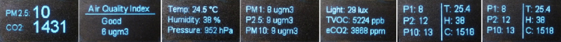
- Press and hold the button from **2 to 5 sec**: On the display you see `LEDs status: OFF`. This means the status LEDs will be tuned off. Do the same to toggle back to `LEDs status: ON`. This setting is saved in the non volatile memory, so it will keep it's setting even if the MCU is restarted. 
- Press and hold the button from **5 to 10 sec**: On the display you see `Night dim: OFF`. This means the LEDs and displays will not be turned off if ambient light fall under 2 lux. Do the same to toggle back to `Night dim: ON`. This setting is saved in the non volatile memory, so it will keep it's setting even if the MCU is restarted. 
- Press and hold from **10 to 15 sec**: On the display you see `MIN-MAX Reset!`. It reset the minimum and maximum values of temperature, PM2.5 and CO2 on screen 6. Please note these resets each time the device is restarted. Keep in mind that 1.5 min after boot and reset, values of CO2 and temperature might not be correct.
- Press and hold from **15 to 20 sec**: It will increase LED brightness correction with +5%. When it reaches +40% another press and hold will make it 0% again. 
- Press and hold from **20 to 30 sec**: On the display for 20 sec it will show the following diagnostic data:
```
YAML ver: (shows version of the esphome yaml config)
ESPHome ver: (ESPHome version which build the firmware)
IP: (IP address if connected to WiFi)
Connected to: (SSID of the wifi, if connected)
LED brightness: (brigtness correction of the LEDs)
```
### LED Brightness control and correction
Led brightness is controlled periodically (each 3 sec), proportional of the ambient light measured by the TLS2561 sensor. If there is no ambient light sensor installed LEDs are constant at 25%, but auto turn off will also not work. Logic of this simple auto control is configured in [this code](firmware/includes/brightness.yaml).

Also by default setting of these LEDs are to begin from 11% brightness. If it's bellow 11% they are turned off. As mentioned in the LED description setting these Chinese LEDs comes with different intensity and the ones listed in Bill of Materials section are too weak at the lowest setting. That's why I added brightness correction setting which can go from 0% to +40% in 5% step. This be done with press and hold the multi function button from 15 to 20 sec (explained above). This setting is saved in the non volatile memory of the MCU and it does not have to be configured after each reset. Alternatively if the device is added in Home Assistant, you will see a template switch called `brightness_correction`, which is doing exactly the same thing as the button on pin.


# FAQ
#### *Can I power it from a battery?*

The device is powered from regular micro USB cable with 5V and consumes between 100-250 mA. You can power it with USB battery pack but not for too long (for example 4000 mAh battery will be depleted in about 20h). If you need to operate it from a battery, firmware have to enter the MCU in a [deep sleep](https://esphome.io/components/deep_sleep.html) mode periodically. You have to build your own firmware. I do not run any of my devices in deep sleep as I do not see a reason for that.
#### *Can it be installed outdoors?*

The device is not waterproof. It can run outdoors if you install it in enclosure which is protecting it from water. It can handle high humidity maybe (never tested it). However the main purpose of the device is to be an internal air quality monitor. Measuring CO2 and VOC outside does not makes too much sense, but it can be used for dust pollution monitoring.

#### *How to calibrate MH-Z19B CO2 sensor?*

Periodically (let's say one time per month) and after installation of a new sensor calibration needs to be performed. The calibration is done by exposing it to the outside air which have about 400ppm CO2 concentration for about 20-30 min and then press and hold the micro button SW2 for more then 7 sec. In that way the value of the sensor is "zeroed" at 400 ppm. Alternatively if the device is added in Home Assistant, there is a template switch called `switch.co2_sensor_zero_calibration` and you just turn it on. It's doing the same as pusing the button but you are doing it remotely over the WiFi. [Here](https://www.circuits.dk/testing-mh-z19-ndir-co2-sensor-module/) are more details about this sensor and calibration.

#### *How to calibrate SGP30 VOC sensor?*

It's explained in [ESPHome manual](https://esphome.io/components/sensor/sgp30.html). You need periodically to update the firmware which is quite easy if you use Home Assistant. In my initial tests I noticed even without calibration value, the sensor shows some values and can detect smells, alcohol vapors, etc. 

#### *How to connect to WiFi?*

After 1 minute of unsuccessful WiFi connection attempts, the microcontroller will start a WiFi hotspot with name `iaq_device` and password `12345678`. When you connect to this fallback hotspot, the web interface should open automatically (see also login to network notifications). If that does not work, you can also navigate to http://192.168.4.1/ manually in your browser. Then type name and password of your local wifi hotspot, click save and MCU will restart and try to connect to the provided network. Additionally from this captive portal you can upload a new firmware.

#### *How to add it in Home Assistant?*

If you have Home Assistant you have to [install the ESPHome addon](https://esphome.io/guides/getting_started_hassio.html), and after that [add the device](https://esphome.io/components/api.html). All sensors, switches, LEDs will appear automatically as entities in Home Assistant. Then you can add them on the dashboard, here is one of my devices added on Home Assistant dashboard with all data from it.

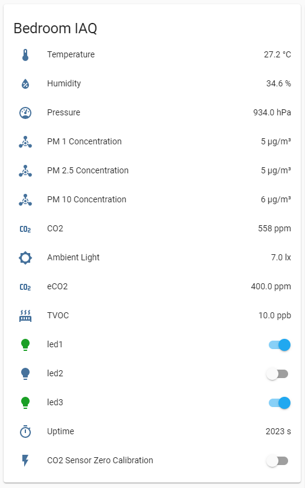

#### *What if some of the sensors/displays is disconnected while the device works?*

Some of the sensors can be accidentally disconnected as on the original design they are not soldered on the PCB but are connected on a header receptacle. No worries with that. On the display you will see `NaN` and it means there is no value from the sensor or it's out of boundaries. Just reseat the sensor and push the reset button on the MCU board or  disconnect and reconnect the USB cable.

### *What about short circuits of the exposed electronics?*

Since all the components are exposed, there is some risk of making a short circuit with a metal object. The power supply is just 5V with limited current so it shouldn't be a big worry. However be careful not to short circuit anything with a conductive object as theoretically this can damage a component. 

# More Tech Details

As I mentioned above the initial design was based on ESP8266 microcontroller. Because of that the PCB is developed for [Wemos D1 Mini board](https://docs.wemos.cc/en/latest/d1/d1_mini.html). Later on I decided it's much better to use ESP32 version, but PCB is not yet redeveloped and PCB silkscreen (writings) is for Wemos D1 Mini with esp8266. 
- J1 external pins was added for some extra pins available on Wemos D1 Mini for eventual connection of external sensors, inputs and outputs. These are all free left pins on esp8266 version. ESP32 version of D1 mini have 2 rows of pin which are directly usable and since there is no place on the PCB, only J1 will stay. The designations D8, D3, A0 are matching Wemos D1 mini ESP8266
- Because of the limitations with only one hardware UART port (which is physically available only on 2 specific pins) of the ESP8266, the dust sensor is using the hardware pins, which are shared with the Wemos D1 USB to UART converter. As a result the uart output of the firmware is disabled and it's not possible to flash the device over USB while it's connected on the PCB. It needs to be disconnected from the PCB and then it can be flashed over the USB. On ESP32 there are 3 dedicated hardware UARTs configuarable on any pin so if I do a next version of the PCB, it will be only for ESP32 and I will free up the USB converter ports for debugging. 
- In the description of [WeMos_D1_mini_ESP32](https://www.aliexpress.com/item/4000880936043.html?spm=a2g0o.productlist.0.0.f387754egZVnTc&algo_pvid=b105e43b-6669-40bc-99c4-cf22d026995d&algo_expid=b105e43b-6669-40bc-99c4-cf22d026995d-6&btsid=0bb0623616009843570355505e4ca0&ws_ab_test=searchweb0_0,searchweb201602_,searchweb201603_) the pins for UART0 are crossed (TX is where RX is shown). It's easy to fix as you can select those pins but if you carefully check the pins you might wonder why is that.
- If ESP8266 version is used there is no second dedicated hardware UART (we need two - one for dust sensor, and one for CO2 sensor). As a result the second one is "software" UART port, which uses [bit banging](https://en.wikipedia.org/wiki/Bit_banging). in combination with the WiFi activity it causes periodic WDT resets of the MCU - sometimes a few times for a few hours which is annoying. And this is one of reasons I use ESP32 now and do not recommend ESP8266.
- on the PCB there are no pullup resistors on the I2C bus. All breakout boards have these pullup resistors, so even attaching only one is enough. However if we install only the ambient light sensor and nothing more, it won't work because there will be no pullups. Also if you add more i2c breakout boards keep an eye of the resistance as it will drop with each extra resistor like [described here](https://www.bluedot.space/tutorials/how-many-devices-can-you-connect-on-i2c-bus/).
- ESP8266 is quite unstable if you try to use AP mode, also enabling http server is too much for this processor. That's why - don't use it, use only ESP32. :smile:
- JP1 solder jumper is for changing i2c slave address of the ambient light sensor. In the datasheet of the sensor are described the different configuration. The default address is when JP1 is not soldered.

# Known issues
These are valid for ESP32 MCU:
- Poor quality of the SGP30 VOC sensor breakout boards from China. The issues and fixes [explained here](https://github.com/nkitanov/iaq_board/issues/10#issuecomment-798994427).
- When you open [the web interface](https://esphome.io/components/web_server.html) of the device - it resets sometimes.
- I had a batch of Neopixel 5050 LEDs which are a bit brighter than the one linked in the BOM section and sometimes they switch to white color and 100% intensity. This is fixed in max 3 sec when correct color and brightness is set back again. These LEDs are set sequentially by their protocol so apparently it interprets wrongly set command or something. This is not happening with the LEDs linked in BOM but keep it in mind that it can happen with some LEDs (especially if they are from a bright batch).
- In the configuration I run the temperature with -1 degreeC offset. I found out these sensors shows a bit higher, and also there is some minimal temperature rise from conducted heat from the PCB. Always connect the BME280 sensor high above the PCB as in my design with the 4 pin receptacle. If you solder it lower on the PCB it might run hotter. For even more precise temperature measurement you can calibrate in esphome the value very precisely if you have access to calibrated thermometer. I was thinking also to experiment with thermocouple on the hole of the dust sensor fan so it can not pick up extra heat. This is in case if you need to use this temperature as input for a thermostat, as I do. 

These are valid for ESP8266 MCU (including the previous issues), not recommended to use that MCU because of the bellow issues:
- periodic [WDT resets](https://en.wikipedia.org/wiki/Watchdog_timer) depending of the WiFi activity, if MCU not connected to WiFi, it's ok. This is caused by the bit banging of the UART interface.
- web server is almost unusable as it needs a lot of memory which is not available on this tiny MCU
- unstable [AP fallback mode](https://esphome.io/components/wifi.html#access-point-mode), causing WDT resets, so sometimes not easy to connect to WiFi without hardcoding the credentials in the firmware

# License 
The device is [Open-source hardware](https://en.wikipedia.org/wiki/Open-source_hardware), [licensed by Open Source Hardware Association](https://certification.oshwa.org/bg000078.html). 

- Hardware is licensed under [CERN-OHL-W v2](https://ohwr.org/cern_ohl_w_v2.txt).
- Software is licensed under [Apache License 2](https://www.apache.org/licenses/LICENSE-2.0)
- Documentation is licensed under [CC-BY-SA-4.0](https://creativecommons.org/licenses/by-sa/4.0/). 

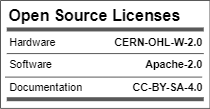


