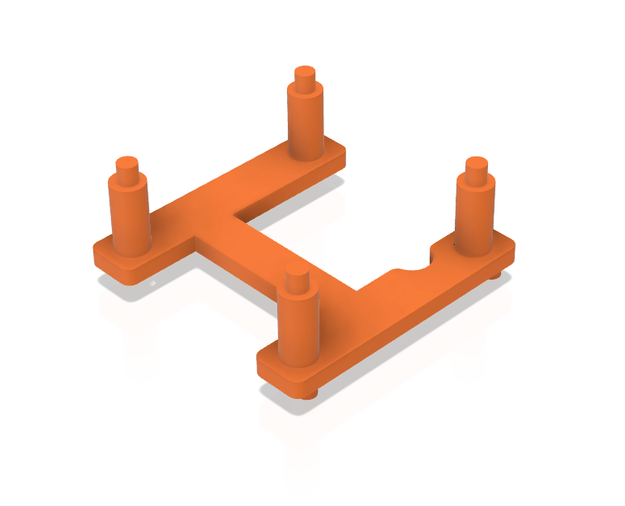

# Stand Case (Holder Body)

The stand is created with [Fusion 360](https://www.autodesk.com/products/fusion-360/overview), here is the shared file design: https://a360.co/2STg8GN. The PCB slides in it and holds the particle sensor.

You can download directly the 3D models step files and print them on a 3D printer:
- [Stand_body.stl](Stand_body.stl) - this is the main body in which the assembled PCB "slides"
- [display_holder_22mm.stl](display_holder_22mm.stl) - this is a small 3d model to install bellow the display. It have 2 small pins for attaching to the PCB. It holds firmly the display from flapping in the receptacle. Keep in mind that it's for displays with holes 22mm each other. There are some other displays with bigger distance. 
- [Stand_pin.stl](Stand_pin.stl) - this is the small pin which is put in to the bottom of the stand and the body can be positioned at about 45 degrees. There is also a hole on the side of the body where the pin can stay when not used

Stand body:

Display holder:
