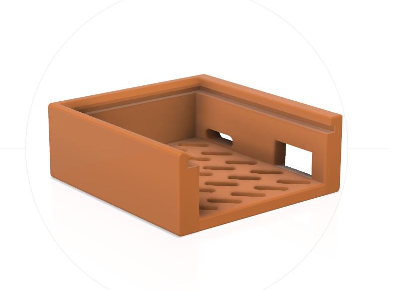

# Stand Case (Holder Body)

The stand is created with [Fusion 360](https://www.autodesk.com/products/fusion-360/overview), here is the shared file design: https://a360.co/2STg8GN. The PCB slides in it and holds the particle sensor.

You can download directly the 3D models step files and print them on a 3D printer:
- [Stand_body.stl](Stand_body.stl) - this is the main body in which the assembled PCB "slides"
- [Stand_pin.stl](Stand_pin.stl) - this is the small pin which is put in to the bottom of the stand and the body can be positioned at about 45 degrees. There is also a hole on the side of the body where the pin can stay when not used

