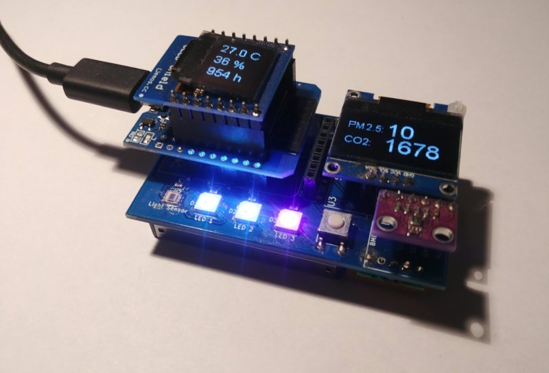
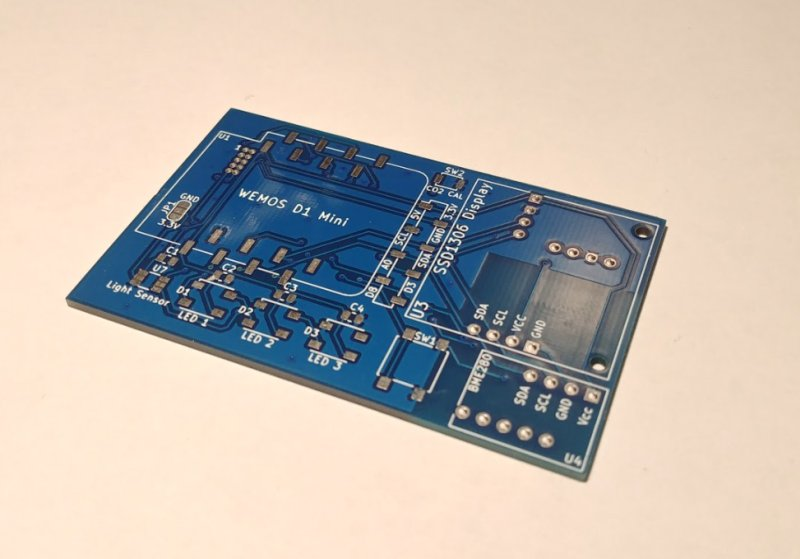
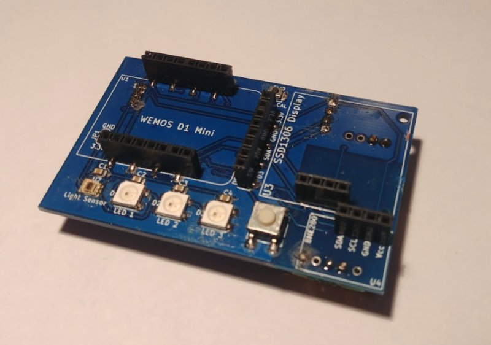
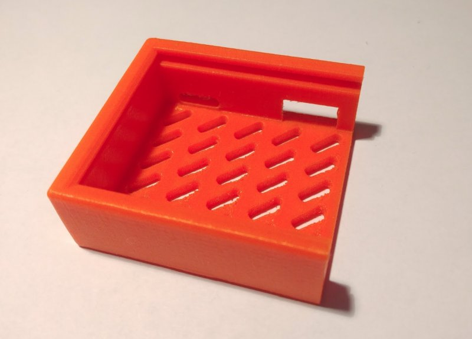

# Ordering

I got some emails from people interested in buying the device, and here are the details in the bellow table. Please note that I do not make this device for mass production and the bellow prices are considered fair for the efforts I need to invest in organizing ordering and building the devices. If you build it yourself it will cost about half these prices with most of the parts from China stores like Aliexpress. 

***Note 1 Sep 2021:** I stop producing fully assembled devices with dust and CO2 sensors. I need focus on another things to do and I am very limited with time to keep the stock of parts. Also the prices of components is constantly increasing and some of them difficult to find. I will continue with making the fully assembled PCBs with all the  parts until I have components in stock and eventually until there is interest.* 

Item | Price (EUR) | Notes 
:-----------------: | :-------------: | :------------- |
[PCB only](#PCB-only) | 5 | You have to order and solder all components yourself.
[Fully assembled PCB without sensors, but including the ambient light senor](#Assembled-PCB) | 35 | with high quality Samtec receptacles and Omron switches. You have to order all the other components yourself and solder the MH-Z19 sensor on the PCB.
[Fully assembled PCB with everything except SGP30, MH-Z19B and PMS7003 sensors, incl. displays and ESP board](#Fully-assembled-excluding-3D-printed-holder) | 70 | You need to order and plug the dust sensor and MH-Z19B sensor yourself
[~~Fully assembled PCB with everything except SGP30 VOC sensor~~](#Fully-assembled-excluding-3D-printed-holder) | ~~92~~ | ~~I rarely use this sensor, that's why adding this option. No case.~~
[~~Fully assembled PCB excluding SGP30 VOC sensor + holder~~](#Fully-assembled-excluding-3D-printed-holder) | ~~99~~ | ~~Complete device plus case excluding SGP30 VOC sensor.~~
[~~Fully assembled PCB incl. everything + holder~~](#Fully-assembled-device-with-holder) | ~~105~~ | ~~this is the complete device~~ **\*** 
[Case holder, PETG material](#Case-holder)  | 7 | color orange only at the moment (like on the photo)

\* *I do not provide completely assembled board with SGP30 TVOC sensor anymore because of the poor quality of these boards ([explained here](https://github.com/nkitanov/iaq_board/issues/10#issuecomment-798994427)), you can buy yourself this board if TVOC is needed.*

***These prices exclude shipping. If you are interested in ordering, please send me an email to nkitanov@gmail.com with your address and I will let you know when the device can be ready as I might not have all parts.***

*Shipping is 7 EUR for one device with registered post, there are other faster options upon request. Payment is with bank transfer (preferably), [Paysera](https://www.paysera.com/) (EU paypal similar service, also preferably) or Paypal. With Paypal if you are non EU account, I will add 2% as they charge me extra [Cross border fee](https://www.paypal.com/mt/webapps/mpp/ua/useragreement-full#tableOfFees1).*

**Please note that due to semiconductor shortage BME280 breakout boards are difficult to find (June 2021) and they are more expensive. I am currently using my own breakout where I solder the BME directly. These are a bit smaller in size than the BME breakout from China. BME280 as IC can be found occasionally in stock from DigiKey.**

### Fully assembled device with holder (excluding SGP30 VOC sensor only)
You can see the device also [in the video](https://www.youtube.com/watch?v=X75OGs2TTT8), also in [this video](https://www.youtube.com/watch?v=b2oDBgN3h1w) is shown how to complete the device with assembled PCB.

### Fully assembled excluding 3D printed holder

### PCB only

### Assembled PCB

### Case holder

